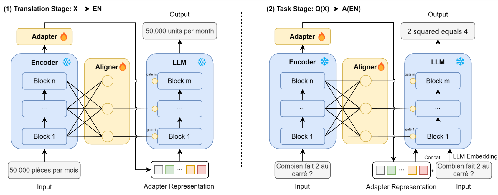

# LayAlign: Enhancing Multilingual Reasoning in Large Language Models via Layer-Wise Adaptive Fusion and Alignment Strategy

The official implementation of the paper [LayAlign: Enhancing Multilingual Reasoning in Large Language Models via Layer-Wise Adaptive Fusion and Alignment Strategy](https://openreview.net/forum?id=KmRjOLJISJ&referrer=%5BAuthor%20Console%5D(%2Fgroup%3Fid%3Daclweb.org%2FNAACL%2F2025%2FConference%2FAuthors%23your-submissions))



## Abstract

Despite being pretrained on multilingual corpora, large language models (LLMs) exhibit suboptimal performance on low-resource languages. Recent approaches have leveraged multilingual encoders alongside LLMs by introducing trainable parameters connecting the two models. However, these methods typically focus on the encoder's output, overlooking valuable information from other layers. We propose Layer-Wise Adaptive Fusion and Alignment Strategy (LayAlign), a framework that integrates representations from all encoder layers, coupled with the adaptive fusion-enhanced attention mechanism to enable layer-wise interaction between the LLM and the multilingual encoder. Extensive experiments on multilingual reasoning tasks, along with analyses of learned representations, show that our approach consistently outperforms existing baselines.

## Table of Contents

- [Environment Setup](#environment-setup)
- [Datasets](#datasets)
- [Models](#models)
- [Experiments](#experiments)
- [Acknowledgement](#acknowledgement)
- [Citation](#citation)


# Environment Setup

We run the experiments on 8 NVIDIA L40 GPU with 48GB memory. The code is developed and tested on Ubuntu 22.04.4 with Python 3.10 and CUDA12.1.

To install the required packages, please follow the instructions below.

```bash
conda create -n LayAlign python=3.10 -y
conda activate LayAlign
#if your CUDA version is 12.1
pip install torch==2.2.0 torchvision==0.17.0 torchaudio==2.2.0 --index-url https://download.pytorch.org/whl/cu121
pip install -r requirements.txt
cd peft
pip install -e ".[train]"
```
> For peft, We use the [layalign_prompt](peft/src/peft/tuners/layalign_prompt) to implement Adaptive Fusion-Enhanced Attention. layalign_prompt(peft/src/peft/tuners/layalign_prompt) is modified from the [adaptation_prompt](https://github.com/huggingface/peft/tree/main/src/peft/tuners/adaption_prompt)


# Datasets
We utilize the [MindMerger](https://github.com/CONE-MT/MindMerger) dataset for our experiments. You can download the dataset [here](https://drive.google.com/drive/folders/1Rm5ppr1fCd4KbiDR2LSFKNChq_uSfiSE?usp=drive_link) and place it in the current directory.

It is important to note that MindMerger later modified its mathematical training dataset. Our study is based on the initial version of the mathematical dataset. Since this version is no longer available in the official documentation, we have provided access to it [here](https://drive.google.com/drive/folders/1evjD7HMLPBel1GKXtg-z77dR8DuCquPl?dmr=1&ec=wgc-drive-hero-goto).

# Models

We use the checkpoint of LayAlign for math based on [MetaMath-7B-V1.0](https://huggingface.co/meta-math/MetaMath-7B-V1.0), for x-csqa based on [LLaMAX-7B-X-CSQA](https://huggingface.co/LLaMAX/LLaMAX2-7B-X-CSQA), and for xnli based on [LLaMAX-7B-X-XNLI](https://huggingface.co/LLaMAX/LLaMAX2-7B-XNLI). [mT5-xl](https://huggingface.co/google/mt5-xl) is used as multilingual encoder. 

You can also download the [checkpoint](https://huggingface.co/SUSTech-NLP/LayAlign/tree/main) which we trained on math tasks using MetaMath-7B-V1.0 and mT5-xl to evaluate mgsm.


# Experiments

## training math
We use a two-stage training to train LayAlign
```
bash scripts/finetune.sh
```

## evaluation math
```
bash scripts/evaluation_mgsm.sh
```

# Acknowledgement

The code is based on the following repositories, we greatly appreciate the authors for their contributions.

- [MindMerger](https://github.com/CONE-MT/MindMerger): a new method for multilingual reasoning.

- [adaptation_prompt in peft](https://github.com/huggingface/peft/tree/main/src/peft/tuners/adaption_prompt)


# License

This project is licensed under the MIT License.


# Citation

If you find this code useful, please consider citing our paper:
```bibtex
@inproceedings{
zhiwenruan2025layalign,
title={LayAlign: Enhancing Multilingual Reasoning in Large Language Models via Layer-Wise Adaptive Fusion and Alignment Strategy},
author={Zhiwen Ruan and Yixia Li and He Zhu and Longyue Wang and Weihua Luo and Kaifu Zhang and Yun Chen and Guanhua Chen},
booktitle={The 2025 Annual Conference of the Nations of the Americas Chapter of the ACL},
year={2025},
url={https://openreview.net/forum?id=KmRjOLJISJ}
}
```
